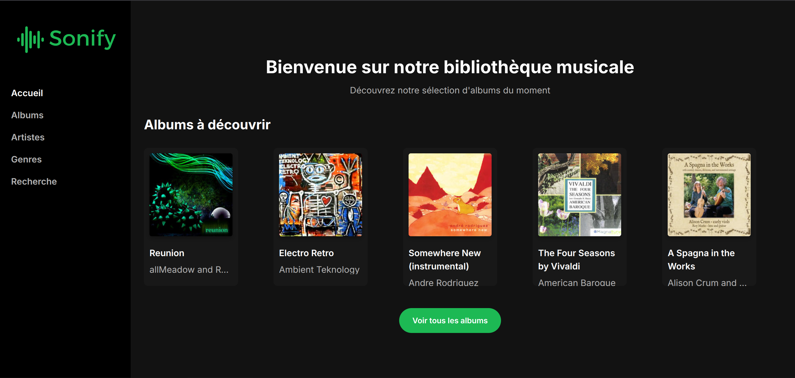

# Sonify



    

Lecteur multimédia en ligne développé dans le cadre d'un projet Epitech Web Academy. Sonify permet de parcourir et d'écouter des albums, artistes et genres musicaux via une interface React connectée à une API REST locale.

---

## Prérequis

- [Node.js](https://nodejs.org/) 18+
- [Docker](https://www.docker.com/) (pour l'API)
- npm

---

## Installation

### 1. Cloner le dépôt

```bash
git clone git@github.com:YetAnotherLea/Sonify.git
cd Sonify
```

### 2. Lancer l'API avec Docker

L'application dépend d'une API locale fournie via une image Docker officielle du projet.

```bash
docker pull matfire/spotitech
docker run -p 8000:8000 matfire/spotitech
```

La documentation complète de l'image est disponible sur [Docker Hub](https://hub.docker.com/r/matfire/spotitech).

Une fois démarrée, l'API est accessible sur : `http://localhost:8000`

### 3. Installer les dépendances et lancer le front-end

```bash
npm install
npm run dev
```

> L'API Docker doit être active **avant** de lancer le front-end.

L'application est accessible sur : `http://localhost:5173`

---

## Architecture

```
src/
├── api/
│   └── api.js          # Fonctions d'appel à l'API REST (albums, artistes, genres, pistes, recherche)
├── components/
│   └── Navbar.jsx      # Barre de navigation principale
├── pages/
│   ├── Genres/
│   │   ├── GenreList.jsx
│   │   └── GenreDetail.jsx
│   ├── Accueil.jsx
│   ├── AlbumList.jsx
│   ├── AlbumDetail.jsx
│   ├── ArtistList.jsx
│   ├── ArtistDetail.jsx
│   ├── Search.jsx
│   └── TestAPI.jsx
├── styles/
├── App.jsx             # Routing principal
└── main.jsx            # Point d'entrée
```

L'URL de l'API est configurable via la variable d'environnement `VITE_API_URL` (par défaut : `http://localhost:8000`).

---

## Fonctionnalités

### Accueil

Affichage aléatoire d'albums à la connexion.

### Recherche

Recherche unifiée par album, artiste ou genre, avec pagination des résultats.

### Albums

- Liste paginée de tous les albums
- Page de détail : informations complètes et pistes audio

### Artistes

- Liste paginée de tous les artistes
- Page de détail : albums associés

### Genres

- Liste des genres musicaux
- Page de détail : albums associés au genre

---

## Stack technique

| Technologie      | Version | Usage                     |
| ---------------- | ------- | ------------------------- |
| React            | 19      | Framework UI              |
| Vite             | 6       | Build tool & dev server   |
| React Router DOM | 7       | Routing client            |
| Axios            | 1.8     | Appels HTTP vers l'API    |
| Docker           | -       | Conteneurisation de l'API |
| ESLint           | 9       | Linting                   |

---

## Auteurs

- Stefan-Paris Paduraru
- Azat Orcer
- Léa Ballester
- Walid Sifer

_Projet réalisé dans le cadre de la Web Academy Epitech Marseille — Promo 2026_
